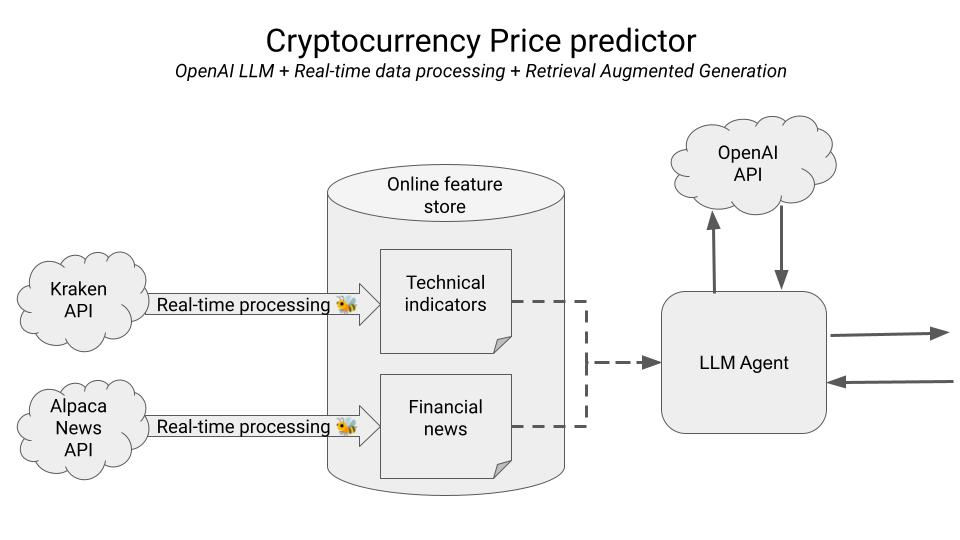

    
    <h1>Build a trading bot with OpenAI GPT-3.5, real-time data and prompt experimentations</h1>
    

 

## TODOs

- [ ] Build and run dataflow for technical indicators
    

- [ ] Build news summarization pipeline.
    - [ ] Create online Feature Store
    - [ ] `.env` file with credentials
    - [ ] Copy working code.
    - [ ] 

